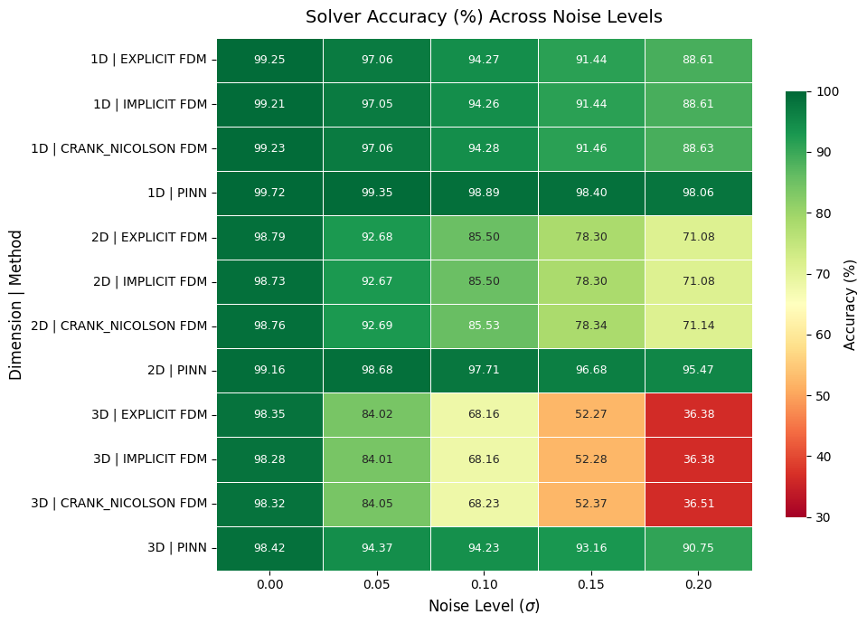
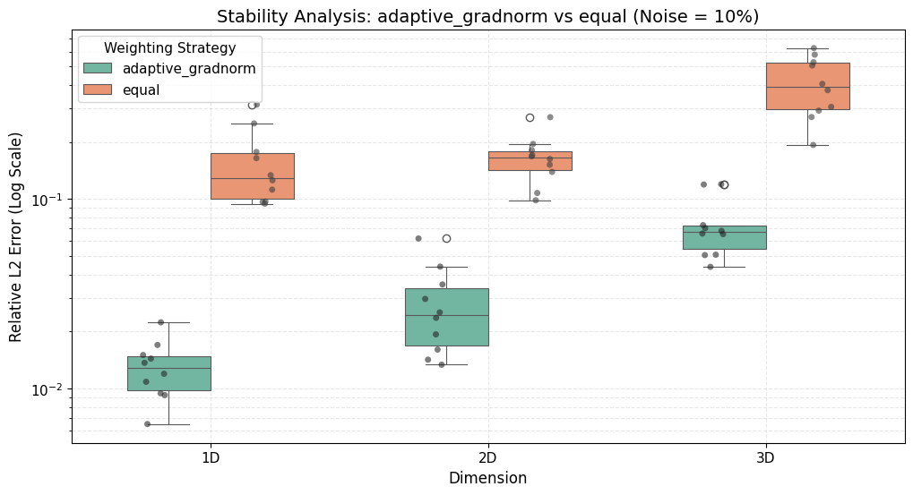

# Overcoming the Limits of Finite Difference Method: Physics-Informed Neural Network for Noisy High-Dimensional Heat Diffusion

## Project Description

This project presents a Physics-Informed Neural Network (PINN) framework for solving transient heat diffusion under noisy boundary conditions across one, two, and three spatial dimensions, establishing clear operational regimes that redefine solver selection against classical Finite Difference Methods (FDM). Under 20% boundary noise in 3D, PINN sustains ~91% accuracy while FDM collapses to ~36%. A physical copper thermal case study confirms PINN reduces boundary reconstruction error by 3.3× under realistic noise. A dimensionality-driven efficiency crossover is also identified: PINN requires fewer space-time nodes than FDM in 3D while simultaneously achieving superior accuracy, exposing the true cost of classical discretization at scale.

**Authors:** <!-- Add authors here -->

**Paper:** <!-- Link to Paper.pdf once available -->

**Key Specifications:**
- **Domain:** Unit domain [0,1]ⁿ, spatial grid 15ⁿ (dx=0.0714 m), temporal range t∈[0,60]s (100 steps)
- **Noise Levels Tested:** 0%, 5%, 10%, 15%, 20% boundary noise
- **Methods:** FDM [Explicit, Implicit, Crank-Nicolson], PINN
- **Best PINN Accuracy (Clean):** 99.72% (1D), 99.16% (2D), 98.42% (3D)
- **Best PINN Accuracy (20% Noise):** 98.06% (1D), 95.47% (2D), 90.75% (3D)
- **FDM Accuracy (20% Noise, 3D):** ~36% (best case)
- **Framework:** PyTorch with deterministic CUDA (Tesla P100-PCIE-16GB)

**The code is available as [olf-pnhdhd.ipynb](olf-pnhdhd.ipynb)**

---

## Table of Contents

- [Project Description](#project-description)
- [Features](#features)
- [Problem Formulation](#problem-formulation)
- [Methodology](#methodology)
- [Model Architecture (PINN)](#model-architecture-pinn)
- [Training Configuration](#training-configuration)
- [Results & Analysis](#results--analysis)
- [Copper Thermal Case Study](#copper-thermal-case-study)
- [Statistical Analysis](#statistical-analysis)
- [Mathematical Foundations](#mathematical-foundations)
- [Known Issues & Limitations](#known-issues--limitations)
- [Dependencies](#dependencies)
- [Primary References](#primary-references)
- [License](#license)

---

## Features

- **Noise Robustness Benchmark:** Systematic evaluation at 0–20% boundary noise across 1D/2D/3D
- **Three FDM Schemes:** Explicit, Implicit, and Crank-Nicolson as baselines
- **Dimensionality Crossover Analysis:** Identifies the regime where PINN becomes both more accurate and more point-efficient than FDM
- **Physical Case Study:** Copper thermal system at T_ref=150K with σ=20% (30K) realistic noise
- **Statistical Rigor:** Mann-Whitney U tests confirming adaptive_gradnorm loss weighting superiority (p=9.13×10⁻⁵ across all dimensions)
- **Reproducible:** Fixed seed (42), deterministic CUDA

---

## Problem Formulation

### Governing Equation

$$\frac{\partial u}{\partial t} = \alpha \nabla^2 u, \quad \alpha = 1.1644 \times 10^{-4} \text{ m}^2/\text{s (copper)}$$

### Boundary Noise Model

Gaussian noise applied at boundaries:

$$u_{\text{noisy}}(\mathbf{x}_b, t) = u(\mathbf{x}_b, t) + \mathcal{N}(0, \sigma^2), \quad \sigma \in \{0, 0.05, 0.10, 0.15, 0.20\}$$

### Initial & Boundary Conditions

- **IC (triangular wave):** u(x,0) = 2x/L for x≤L/2, 2(L−x)/L for x>L/2; extended as products for 2D/3D
- **BC:** Homogeneous Dirichlet (u) = 0 at all boundaries (subject to noise perturbation)

### Computational Domain

| Dimension | Space-Time Points | Spatial Grid | Time Steps |
|-----------|-------------------|--------------|------------|
| 1D | 1,500 | 15 nodes | 100 |
| 2D | 22,500 | 15×15 nodes | 100 |
| 3D | 337,500 | 15×15×15 nodes | 100 |

---

## Methodology

### Finite Difference Methods

| Scheme | Formulation | Stability r (1D/2D/3D) |
|--------|-------------|------------------------|
| Explicit | Forward Euler | 0.0137 / 0.0274 / 0.0411 |
| Implicit | Backward Euler + sparse inversion | 0.0137 / 0.0274 / 0.0411 |
| Crank-Nicolson | θ-method, θ=0.5 | 0.0137 / 0.0274 / 0.0411 |

All stability parameters r = α·(dt/dx²) are well below the critical threshold of 0.5. Under noisy boundary conditions, FDM propagates boundary error directly into the interior solution with no attenuation mechanism.

### Physics-Informed Neural Networks

Fully connected feedforward networks trained on weighted PDE + BC + IC loss. Collocation points sampled via Latin Hypercube Sampling (LHS), resampled every 100 epochs. The PDE residual loss acts as an implicit regularizer, suppressing noise propagation from boundary conditions.

**Collocation Point Budget:**

| Dimension | PDE | BC | IC | Total |
|-----------|-----|----|----|-------|
| 1D | 3,000 | 1,000 | 2,000 | 6,000 |
| 2D | 30,000 | 10,000 | 20,000 | 60,000 |
| 3D | 60,000 | 20,000 | 40,000 | 120,000 |

---

## Model Architecture (PINN)

**Best Configurations per Dimension:**

| Dim | Depth | Width | Activation | LR | Optimizer | Loss Weighting | Init | Time (s) | Memory (MB) |
|-----|-------|-------|------------|-----|-----------|----------------|------|----------|-------------|
| 1D | 2 | 8 | tanh | 5×10⁻³ | Adam | adaptive_gradnorm | Kaiming | 68.5 | 67 |
| 2D | 6 | 64 | tanh | 5×10⁻⁴ | Adam | adaptive_gradnorm | Xavier | 221.9 | 919 |
| 3D | 6 | 128 | tanh | 5×10⁻⁴ | Adam | adaptive_gradnorm | Xavier | 894.2 | 4,503 |

**Key findings:** tanh consistently outperforms other activations; adaptive_gradnorm loss weighting is statistically superior to equal weighting across all dimensions (Mann-Whitney p=9.13×10⁻⁵); Adam-only achieves best results across all noise levels.

---

## Training Configuration

### Hyperparameters

| Parameter | Value |
|-----------|-------|
| **Training Epochs** | 6,000 |
| **LR Options** | 5×10⁻³, 5×10⁻⁴ |
| **Optimizer** | Adam |
| **LR Decay** | Exponential (γ=0.99) |
| **Gradient Clipping** | Dimension dependent |
| **Early Stopping** | loss > 16 after epoch 400 |
| **Collocation Resampling** | Every 100 epochs (LHS) |

### Loss Function

$$\mathcal{L} = w_{\text{PDE}}\mathcal{L}_{\text{PDE}} + w_{\text{BC}}\mathcal{L}_{\text{BC}} + w_{\text{IC}}\mathcal{L}_{\text{IC}}$$

Two weighting strategies compared: equal vs. adaptive_gradnorm. adaptive_gradnorm is statistically superior across all dimensions.

| Dim | Weighting | Mean Error | Std | CV (%) |
|-----|-----------|------------|-----|--------|
| 1D | adaptive_gradnorm | 0.01304 | 0.00453 | 34.73 |
| 1D | equal | 0.15661 | 0.07367 | 47.04 |
| 2D | adaptive_gradnorm | 0.02828 | 0.01532 | 54.17 |
| 2D | equal | 0.16444 | 0.04817 | 29.29 |
| 3D | adaptive_gradnorm | 0.07263 | 0.02647 | 36.45 |
| 3D | equal | 0.40800 | 0.14524 | 35.60 |

---

## Results & Analysis

### Accuracy Under Noise

| Dim | Method | 0% Noise | 5% Noise | 10% Noise | 15% Noise | 20% Noise |
|-----|--------|----------|----------|-----------|-----------|-----------|
| **1D** | Explicit FDM | 99.25% | 97.06% | 94.27% | 91.44% | 88.61% |
| | Crank-Nicolson FDM | 99.23% | 97.06% | 94.28% | 91.46% | 88.63% |
| | **PINN** | **99.72%** | **99.35%** | **98.89%** | **98.40%** | **98.06%** |
| **2D** | Explicit FDM | 98.79% | 92.68% | 85.50% | 78.30% | 71.08% |
| | Crank-Nicolson FDM | 98.76% | 92.69% | 85.53% | 78.34% | 71.14% |
| | **PINN** | **99.16%** | **98.68%** | **97.71%** | **96.68%** | **95.47%** |
| **3D** | Explicit FDM | 98.35% | 84.02% | 68.16% | 52.27% | 36.38% |
| | Crank-Nicolson FDM | 98.32% | 84.05% | 68.23% | 52.37% | 36.51% |
| | **PINN** | **98.42%** | **94.37%** | **94.23%** | **93.16%** | **90.75%** |

**At 20% noise in 3D, PINN sustains 90.75% accuracy while the best FDM achieves only 36.51% — a 54-percentage-point gap.**

### Discretization Efficiency

| Dimension | FDM Space-Time Nodes | PINN Collocation Points | Efficiency Ratio (FDM/PINN) |
|-----------|----------------------|-------------------------|-----------------------------|
| 1D | 1,500 | 6,000 | 0.25× |
| 2D | 22,500 | 60,000 | 0.38× |
| 3D | 337,500 | 120,000 | **2.81×** |

In 3D, PINN uses 2.81× fewer space-time nodes than FDM while simultaneously achieving superior accuracy under noise — a crossover driven by the curse of dimensionality.

| Accuracy Heatmap (PINN vs FDM across Noise & Dimension) |
|:--:|
|  |

---

## Copper Thermal Case Study

Physical copper system at T_ref=150K, σ=20% (30K absolute noise), evaluated at t=60s.

**Boundary face (z=0) reconstruction:**

| Metric | FDM | PINN |
|--------|-----|------|
| Max error (K) | 7.04 | 6.85 |
| Mean error (K) | 7.04 | 2.13 |
| **Mean error reduction** | — | **3.3× lower** |

FDM produces a uniform 7.04K mean error across the boundary face with zero variance — the boundary noise is absorbed rigidly. PINN mean error is 2.13K with std=1.44K, demonstrating active interior regularization via the PDE loss term.

---

## Statistical Analysis

Mann-Whitney U tests confirm that adaptive_gradnorm loss weighting produces statistically significantly lower errors than equal weighting across all dimensions.

| Dimension | p-value | Result |
|-----------|---------|--------|
| 1D | 9.13×10⁻⁵ | Significant — adaptive_gradnorm superior |
| 2D | 9.13×10⁻⁵ | Significant — adaptive_gradnorm superior |
| 3D | 9.13×10⁻⁵ | Significant — adaptive_gradnorm superior |

| Mann-Whitney Test: Error Distribution by Weighting Strategy |
|:--:|
|  |

---

## Mathematical Foundations

### PINN Loss

$$\mathcal{L}_{\text{PDE}} = \frac{1}{N_f}\sum_{i=1}^{N_f}\!\left|\frac{\partial \hat{u}}{\partial t} - \alpha\nabla^2\hat{u}\right|^2, \quad \mathcal{L}_{\text{BC}} = \frac{1}{N_b}\sum_{i=1}^{N_b}|\hat{u}(\mathbf{x}_b^i, t^i)|^2, \quad \mathcal{L}_{\text{IC}} = \frac{1}{N_0}\sum_{i=1}^{N_0}|\hat{u}(\mathbf{x}^i, 0) - u_0(\mathbf{x}^i)|^2$$

### Adaptive GradNorm Weighting

Loss weights updated each epoch proportional to gradient norms:

$$w_k \leftarrow \frac{\|\nabla_\theta \mathcal{L}_k\|}{\sum_j \|\nabla_\theta \mathcal{L}_j\|}$$

This prevents any single loss term from dominating training, which is critical under noisy boundary conditions where $\mathcal{L}_{\text{BC}}$ would otherwise be amplified.

### FDM Stability

Explicit scheme stability: r = α·(dt/dx²) < 0.5. Actual values (r = 0.0137 / 0.0274 / 0.0411 for 1D/2D/3D) are all safely below the critical threshold — meaning FDM degradation under noise is not a stability failure, but a fundamental inability to attenuate boundary perturbations.

---

## Known Issues & Limitations

**1. PINN Computational Cost**
PINN requires ~1,500–81,000× more wall-clock time than explicit FDM. For clean, low-dimensional, real-time applications, explicit FDM remains strictly faster.

**2. Memory Scaling**
PINN memory: 67 MB (1D) → 919 MB (2D) → 4,503 MB (3D). A high-VRAM GPU (≥16GB) is required for 3D experiments.

**3. Noise Model Scope**
Noise is applied only at boundary conditions. Interior noise or time-varying noise characteristics are not evaluated.

**4. Unit Hypercube Domain Only**
Current implementation assumes [0,1]ⁿ domains. Irregular geometries require mesh-based or adaptive collocation strategies.

**5. Fixed Hyperparameter Configuration**
Noise robustness is evaluated on the clean-data-optimal PINN configuration. Noise-aware hyperparameter tuning may yield further accuracy gains.

---

## Dependencies

```
pip install torch==2.3.1+cu121 torchvision==0.18.1+cu121 --index-url https://download.pytorch.org/whl/cu121
```

**Hardware:** NVIDIA GPU with ≥16GB VRAM recommended for 3D PINN experiments.

---

## Primary References

M. Raissi, P. Perdikaris, and G. E. Karniadakis, *Physics Informed Deep Learning (Part I): Data-driven Solutions of Nonlinear Partial Differential Equations*, arXiv:1711.10561, 2017. https://arxiv.org/abs/1711.10561

---

## License

This project is licensed under the MIT License. See [LICENSE](LICENSE) for details.
